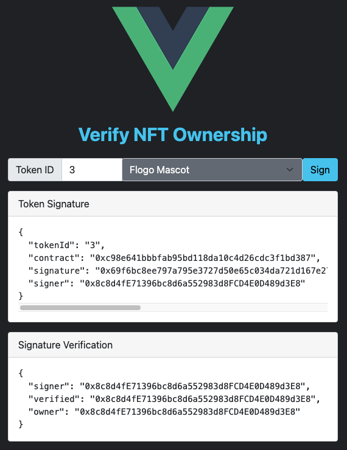

# NFT Token Ownership Verification with Vue.js and Node.js

This project uses an [NFT](https://ethereum.org/en/developers/docs/standards/tokens/erc-721/) usecase to illustrate how to implement a Web3 application from scratch.

We choose to use the [Express](https://expressjs.com/) Node.js application framework to implement the backend API service, and [Vue.js](https://vuejs.org/) JavaScript framework to implement the web user interface.

The application can verify that a crypto wallet owner really owns a specified NFT token.  In the application's web UI, a user can enter an NFT contract address and a token ID to be verified.  The UI will send a message signing request to the user's wallet plugin (assuming that user is logged in to a MetaMask Chrome plugin), and prompt the user to sign a message containing the NFT contract address and token ID.  After the user signs the message by using the private key in the wallet, the signature will be sent to a backend API service for verification.  The API service will extract the signer's public address from the signature, and query the blockchain to retrieve the owner of the specified NFT token, and then return both the verified signer's address and the token owner's address.  If these 2 addresses match, it proves that wallet owner must be the current owner of the specified NFT token.

## Prerequisite 

### Install Node.js

I use `zsh` on a Mac, and installed `Node.js` by using [nvm](https://github.com/nvm-sh/nvm#installing-and-updating) i.e.,

```sh
touch ~/.zshrc
curl -o- https://raw.githubusercontent.com/nvm-sh/nvm/v0.39.0/install.sh | bash
nvm install node
```

Verify that `Node.js` and `npm` are installed correctly, i.e.,

```sh
nvm -v
npm -v
node -v
```

### Configuration

Install MetaMask plugin for Chrome from [here](https://metamask.io/download/), and then create an account if you do not already have a wallet.

Create an account at [infura.io](https://infura.io/), and then create an Ethereum project.  Copy the endpoint URL for the `rinkeby` test network, and use the URL in the API server configuration file, [api/config.json](./api/config.json).

## Start the application as is

For development by default, this application will start a backend API server on port `3070`, and a Vue web UI proxy on port `8082`.  You can start these processes in separate terminals as follows.

```sh
# start the Node.js API server on port 3070
cd api
npm install
npm run dev

# start the Vue.js UI proxy on port 8082
cd nft-app
npm install
npm run serve
```

View the web UI in a Chrome browser at http://localhost:8082/. Login to your wallet in MetaMask browser plugin.  In the web UI, enter a Token ID of `1` through `4`, and select an NFT contract, then click the `Sign` button to see the verification result, which should look like the following:



## Implement the API service from scratch

In an empty project folder, e.g., `~/jsprojects/vue-nft-delivery`, create a JavaScript project from scratch, i.e,

```sh
mkdir api -P && cd api
npm init
```

Enter the following parameters when prompted by the command `npm init`:

```
package name: (api)
version: (1.0.0)
description: backend for nft-delivery
entry point: (index.js) server.js
test command: test
git repository: https://github.com/johndoe/vue-nft-delivery
keywords: nft
author: John Doe
license: (ISC)
```

This will create a file [package.json](./api/package.json), which you can edit if you want to change any of the parameters.

We use the [Express](https://expressjs.com/) framework to implement backend service APIs.  Besides, for convenience during the development, we use [nodemon](https://nodemon.io/) to restart the API server automatically whenever the code is updated.  So, add these dependencies for runtime and dev-only.

```sh
npm install --save express
npm install --save-dev nodemon
```

The service APIs will use [ethers.js](https://docs.ethers.io/v5/) to verify message signature, and use [web3.js](https://web3js.readthedocs.io/en/v1.7.1/) to connect to an Ethereum node and call smart contract methods.  For development, we use [webpack](https://webpack.js.org/) to build production bundle of the application scripts and assets.  So add these dependencies as well.

```sh
npm install --save ethers web3
npm install --save-dev webpack webpack-cli
```

We are now ready to write the API code.  All APIs are implemented in [server.js](./api/server.js).  If you are not familiar with the `express` framework, you may find the references at the end of this doc helpful.

The `server.js` implements 2 APIs:

* `/api/contracts` will return a list of pre-configured NFT contracts whose tokens can be verified by this application.
* `/api/verify` will verify the user's signature of a NFT token ID, and retrieve the owner of a specified NFT token from an Ethereum node.

It also uses [express.static](https://expressjs.com/en/starter/static-files.html) to serve static web content in a `/public` folder, as well as the application bundle of the web UI in `/nft-app`, which we'll implement in the next section.

During the development, the API server will listen on an HTTP port, but for production build, we should change it to use HTTPS.

The configuration parameters are read from the file [config.json](./api/config.json), which includes

* `port` is the API server's listen port.
* `infura` is the URL of Ethereum node in [infura](https://infura.io/).  You can create a free account in `infura`, and then create a project, and copy the project's endpoint for the Ethereum network where your NFT is minted and/or traded.
* `contracts` is a list of NFT contracts to be handled by this application.  The sample entries list 2 NFT contracts that I created on the `rinkeby` test network.  This list will be displayed as a selection list on the web UI that we'll implement in the next section.  If you are interested in how to create such NFT contracts from scratch, refer to the [Sample NFT](https://github.com/yxuco/enft) project.

The API `/api/verify` uses the contract ABI of the standard ERC-721 specification to fetch the owner address of a specified token.  Thus, we store a copy of the ABI definition in [erc721.json](./api/erc721.json).

Create [webpack.config.js](./api/webpack.config.js) for production bundle.  Note that we'll build the production bundle to a parent `../dist` folder where we can add the web UI bundle later.  We also added a rule to avoid the build error `Can't resolve 'electron'` for `web3.js`.

Edit the scripts in [package.json](./api/package.json) for development and production.  The production `start` script assumes that the application bundle is produced in the parent `../dist` folder.  

Start the API server using command `npm run dev`, which uses `nodemon` to watch files, and so the API server will automatically restart whenever the code is updated.

Verify the API server by sending a request from another terminal: `curl http://localhost:3070/api/contracts`.

Build the production bundle using command `npm run build`.  Start the production server using command `npm run start`.

## Implement the Vue web UI from scratch

In the project folder, e.g., `~/jsprojects/vue-nft-delivery`, create a `Vue.js` project named `nft-app`:

```sh
# install Vue CLI globally if it is not done already
npm install -g @vue/cli

# create new project
vue create nft-app
```

We use the [Bootstrap Vue 3](https://www.npmjs.com/package/bootstrap-vue-3) framework to build responsive web UI.  It uses `BootstrapVue` web components as described [here](https://bootstrap-vue.org/docs/components), and `Bootstrap` CSS classes as described [here](https://getbootstrap.com/docs/5.1/utilities/api/).

The web UI uses [ethers.js](https://docs.ethers.io/v5/) to sign messages, and uses [axios](https://axios-http.com/docs/intro) to call backend APIs over HTTP/HTTPS.  So add these dependencies:

```sh
cd nft-app

# dependencies for message signature and verification
npm install --save axios ethers

# dependencies for UI components and css classes
npm install --save bootstrap bootstrap-vue-3
```

We are now ready to write code for the web UI. If you are not familiar with the `vue.js` or `bootstrap-vue` framework, you may find the references at the end of this doc helpful.

Edit the scripts in [package.json](./nft-app/package.json) to make it `serve` on port `8082`.

Edit the configuration file [vue.config.js](./nft-app/vue.config.js) to specify the URL of the backend API server as specified in the previous section, i.e., http://localhost:3070.  It also specifies the output folder for production bundle, which we'll build later in this section.

Edit the file [main.js](./nft-app/src/main.js) to register `bootstrap-vue`, so it will be available for all the application components.

The file [SigService.js](./nft-app/src/services/SigService.js) implements service functions for the UI to interact with MetaMask wallet for signature calculation, and to call backend service APIs.

The only Vue.js UI component for this application is implemented in [SignMessage.vue](./nft-app/src/components/SignMessage.vue).  When the component is loaded, it calls the backend API `/api/contracts` and uses the returned result to initialize the NFT contract selection list.  When the user clicks the `Sign` button, it send a request to MetaMask wallet where the user can sign a message by using the private key in the wallet.  When the signature is updated, a watcher method will pick the updated signature and call the backend API `/api/verify`, and then display the verification result.  When HTTPS transport is used by the backend API server, this approach could be a reliable mechanism for web3 user authentication.  For even better security, however, we may add a step to request a random `nounce` from the backend server, and so the user will sign a dynamically generated random message, instead of a static NFT token ID.

Edit the root component [App.vue](./nft-app/src/App.vue) to include the `SignMessage` as a child component under the root.

Note that the file [.eslintrc.js](./nft-app/src/components/.eslintrc.js) contains an `ESLint` rule to disable the syntax check for `multi-word-component-names`, and so component names do not have to use multiple words.  It is not necessary for this project because the only component of the project, `SignMessage` contains 2 words.  However, if you add a component with a single-word name, e.g., `Header`, you will see a compilation error:

```
error  Component name "Header" should always be multi-word  vue/multi-word-component-names
```

The additional ESLint rule  in [.eslintrc.js](./nft-app/src/components/.eslintrc.js) would be necessary to override the default behavior.

Start the web UI proxy server by using the following command.  It'll pick up code changes automatically, and thus you do not have to restart it during development.

```sh
cd nft-app
npm run serve
```

View the web UI in a Chrome browser at http://localhost:8082/, and start testing.

## Build production bundle

For production, we can build the applicaton bundle to the same `../dist` folder and so the same `Node.js` server will serve both the API service and the web UI, as well as other static content in a `public` folder.  As described in the API service implementation [server.js](./api/server.js), the API server bundle will be output to the root of `../dist`, and the web UI bundle will be output to the sub-folder `../dist/nft-app`.  The following scripts will perform the build tasks.

```sh
cd ../api
npm run build

cd ../nft-app
npm run build
```

Start the production application server using the following command.

```sh
cd ../dist
node serer.bundle.js
```

View the web UI in a Chrome browser at http://localhost:3070/. Login to your wallet in MetaMask browser plugin.  In the web UI, enter a Token ID of `1` through `4`, and select an NFT contract, then click the `Sign` button to see the verification result.

You can add any other static HTML pages, such as sample files under [/public](./api/public/) to the folder `../dist/public`, and so they can be viewed at http://localhost:3070/public.

If you update the server port and/or other configuration parameters in [config.json](./api/config.json), you'll have to rebuild the production bundles, and then restart the `Node.js` server.

## References

* [Node.js Express Tutorial](https://www.digitalocean.com/community/tutorials/nodejs-express-basics)
* [Setup HTTPS for Express Server](https://adamtheautomator.com/https-nodejs/)
* [Express API Reference](https://expressjs.com/en/5x/api.html)
* [Webpack Tutorial](https://dev.to/antonmelnyk/how-to-configure-webpack-from-scratch-for-a-basic-website-46a5)
* [Web3 Call Smart Contract](https://ethereum.org/en/developers/tutorials/calling-a-smart-contract-from-javascript/)
* [Web3.js API Reference](https://web3js.readthedocs.io/en/v1.7.1/web3.html#setprovider)
* [BootstrapVue Tutorial](https://blog.logrocket.com/getting-started-with-bootstrapvue-2d8bf907ef11/)
* [Bootstrap css Reference](https://getbootstrap.com/docs/5.1/utilities/api/)
* [BootstrapVue Component Reference](https://bootstrap-vue.org/docs/components)
* [Web Application with Node.js and Vue](https://levelup.gitconnected.com/vue-node-web-application-59d3376e403e)
* [Vue.js and Node.js Example](https://github.com/bbachi/vuejs-nodejs-example.git)
* [Ethers MetaMask Message Signature](https://codesandbox.io/s/react-eth-metamask-signatures-ibuxj)
* [Write mobile web3 crypto apps on iOS and Android](https://nickconfrey.medium.com/how-to-write-mobile-web3-crypto-apps-on-ios-and-android-3c0854e2110f)
